# Chest X-ray Abnormalities Detection

---

## Project Overview

### 1. Introduction
The **VinBigData Chest X-ray Abnormalities Detection** project focuses on building an AI-based solution for detecting thoracic abnormalities from chest X-ray images. This project utilizes the **VinBigData dataset**, which includes a wide range of annotated chest conditions, aiming to improve diagnostic accuracy in the medical field.

This project is based on the [VinBigData Chest X-ray Abnormalities Detection Challenge](https://www.kaggle.com/c/vinbigdata-chest-xray-abnormalities-detection/overview) hosted on Kaggle. The challenge invited over 1,200 teams to develop models that could classify and localize 14 thoracic abnormalities using 18,000 expert-annotated X-ray images.

By automating the detection process, this project helps reduce the workload on radiologists and speeds up diagnostics in healthcare systems, especially in environments with a high volume of cases. AI’s consistency in analyzing medical images ensures accurate and reliable predictions, helping improve patient outcomes through early detection.

<p align="center">
  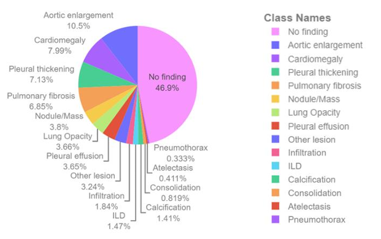
</p>

### 2. Key Goals
- **Develop a robust AI model** capable of detecting 14 specific thoracic conditions, including aortic enlargement, atelectasis, and cardiomegaly.
- **Alleviate the workload on radiologists** by providing an AI-assisted tool that can quickly and accurately identify abnormalities in chest X-rays.
- **Ensure consistent and accurate diagnostic predictions**, improving the reliability of healthcare diagnostics and reducing variability in radiologic interpretation.

----

## Repository Structure

The repository is organized as follows:
```bash
Chest_X-ray_Abnormalities_Detection/
│
├── Images/                                      # Contains figures used in the README and project report
│   ├── Figure1.png                              # Pie chart of abnormality distribution
│   ├── ...                                      # Annotations per class
├── Proc_data/                                   # Processed datasets (original sizes)
│   ├── train/                                   # Training data images
│   ├── test/                                    # Test data images
│   ├── Original_Image_Dimensions.csv            # CSV file with original image dimensions
│   ├── Test_Image_Dimensions.csv                # CSV file with test image dimensions
│   ├── train.csv                                # Training dataset metadata
│   └── sample_submission.csv                    # Sample submission file
│
├── proc_data_512/                               # Resized dataset (512x512)
│   ├── train/                                   # Resized training data
│   ├── test/                                    # Resized test data
│   ├── Original_Image_Dimensions.csv            # CSV file with original image dimensions for resized data
│   └── Test_Image_Dimensions.csv                # CSV file with test image dimensions for resized data
│
├── results/                                     # Model results and logs
│   ├── debug/                                   # Debugging data, logs, and final model checkpoints
│   │   ├── inference/                           # Inference results
│   │   ├── AP40.png                             # Average precision curve at IoU 0.40
│   │   ├── loss.png                             # Training loss plot
│   │   ├── flags.yaml                           # Model training configuration
│   │   └── metrics.json                         # Performance metrics for debugging
│   ├── det/                                     # Final detection results
│   │   ├── vinbigdata_0_aug0.jpg                # Example detection results for image 0
│   │   ├── vinbigdata_1_aug0.jpg                # Example detection results for image 1
│   └── test_512x512/                            # Test set results
│       └── submission.csv                       # CSV file for submission
│
├── v20/                                         # Model training metrics for version 20
│   └── metrics.json                             # JSON file containing metrics for this model version
│
├── DataResize.ipynb                             # Jupyter notebook for resizing the dataset images
├── DataVisualisation.ipynb                      # Notebook for visualizing and analyzing the dataset
├── ModelTraining.ipynb                          # Notebook for training the model
├── ModelTesting.ipynb                           # Notebook for testing and evaluating the trained model
├── Report.pdf                                   # Full project report detailing methodology and results
└── requirements.txt                             # Project dependencies and libraries
```
---

## System Requirements

To run this project efficiently, a system with adequate computational resources is necessary due to the large dataset and intensive model training involved. Below are the recommended hardware and software specifications:

<p align="center"> 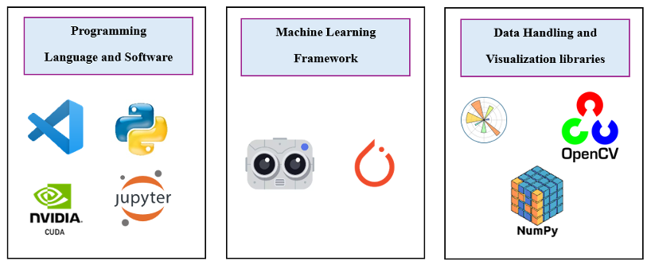 </p>

### 1. Hardware Requirements
- **Minimum RAM**: 8 GB (16 GB recommended)
- **Processor**: Quad-core CPU or higher (recommended for parallel processing during model training)
- **Storage**: At least 50 GB of free disk space for datasets, models, and results
- **GPU (optional but highly recommended)**: A CUDA-compatible GPU (e.g., NVIDIA) is suggested for faster training of the deep learning models, particularly when using TensorFlow or PyTorch.

### 2. Software Requirements
- **Operating System**: Windows, macOS, or Linux
- **Python Version**: Python 3.8 or higher is required due to dependencies on newer libraries.
- **CUDA Toolkit (optional)**: Required for leveraging GPU-based training (only if using a compatible NVIDIA GPU)

### 3. Key Libraries and Tools
This project relies on several open-source libraries and tools to preprocess the data, train the model, and evaluate its performance.

#### 3.1. Programming Languages
- **Python 3.8+**: The primary programming language used for data preprocessing, model training, and evaluation.

#### 3.2. Machine Learning Frameworks
- **PyTorch**: The main deep learning framework used to train the object detection model.
- **Detectron2**: A Facebook AI Research (FAIR) library built on PyTorch, used for implementing object detection tasks.
  
#### 3.3. Data Handling and Visualization Libraries
- **NumPy**: For handling multi-dimensional arrays and performing mathematical operations.
- **Pandas**: Used for data manipulation, handling CSV files, and processing dataset metadata.
- **OpenCV**: Utilized for image manipulation, resizing, and transformations.
- **Matplotlib** and **Seaborn**: Libraries for data visualization and graphical representation of model performance metrics.

#### 3.4. Additional Libraries
- **Albumentations**: A fast and flexible image augmentation library for advanced image transformations, which is essential for augmenting the dataset to increase diversity.
  
To install all the required libraries, run the following command:

```bash
pip install -r requirements.txt
```
---

## Dataset

### 1. VinBigData Chest X-ray Dataset
The dataset used for this project is the **VinBigData Chest X-ray Dataset**, consisting of 18,000 chest X-ray images. These images are annotated with 14 different thoracic abnormalities:

- Aortic enlargement
- Cardiomegaly
- Pleural thickening
- Pulmonary fibrosis
- Nodule/Mass
- Lung opacity
- Pleural effusion
- Other lesion
- Infiltration
- ILD (Interstitial Lung Disease)
- Calcification
- Consolidation
- Atelectasis
- Pneumothorax

This dataset provides a comprehensive foundation for training models to detect various abnormalities, which significantly aids in automating diagnostic processes.

<p align="center">
  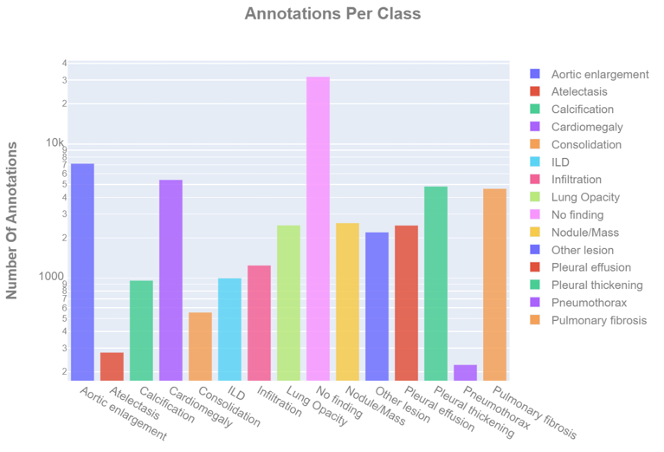
</p>


### 2. Data Preprocessing
The preprocessing of this dataset is pivotal to ensuring its compatibility with machine learning models and optimizing the computational load during training and analysis. This stage encompasses several essential steps:

### 2.1. Conversion to PNG
To facilitate easier manipulation and compatibility with a broader range of image processing tools, the X-ray images were converted from the original **DICOM format** to **PNG format**. This conversion not only reduces file sizes significantly (from approximately 200 GB to around 0.5 GB) but also simplifies the application of image processing techniques, which is crucial for large-scale model training.


### 2.2. Image Resizing
The images were resized to two standard resolutions: **256x256** and **512x512** pixels. Resizing serves several purposes:
- **Reduced computational resource requirements**: Smaller images require less memory and processing power, speeding up model training and reducing hardware constraints.
- **Faster training times**: Training on smaller images accelerates the overall process.
- **Decreased risk of overfitting**: Smaller images limit the number of learnable parameters, preventing the model from overfitting to the data.
- **Consistency**: Using standardized image sizes ensures uniformity, which is essential for batch processing in most deep learning frameworks.

<p align="center">
  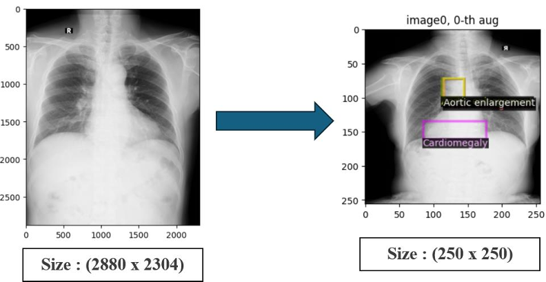
</p>

### 2.3. Monochromatism Correction
Some images in the dataset exhibited **monochromatism**, which could skew the results and lead to misinterpretations by computer vision models. A specific preprocessing step was applied to correct these monochrome images, ensuring consistency in visual data representation. This correction ensures that all images have similar chromatic properties, allowing the model to learn features effectively without being confused by variations in intensity and contrast.

<p align="center">
  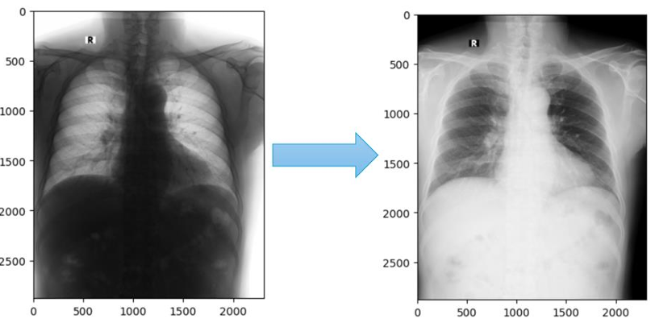
</p>

### 3. Data Split
The dataset is divided into three subsets to allow for training, validation, and testing:

- **Training Set**: The majority of the data is used for training the model, learning the patterns associated with the different abnormalities.
- **Validation Set**: A smaller subset is used during model training to adjust hyperparameters and monitor performance.
- **Testing Set**: This final subset is held back to assess the model’s performance on unseen data.

<p align="center">
  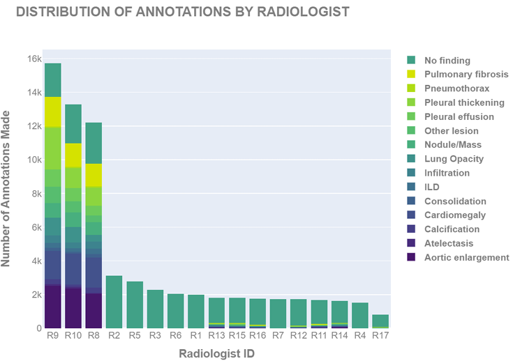
</p>

### 4. Data Augmentation

Data augmentation plays a critical role in improving the model's robustness by artificially increasing the diversity of the training data. For this project, various augmentation techniques were applied to ensure that the model can generalize better to unseen data. These techniques help create variations in the dataset and prevent overfitting. The **Albumentations** library was used for implementing these augmentation methods due to its flexibility and efficiency.

### 4.1. Horizontal and Vertical Flips
- **Purpose**: Simulate different orientations of the chest X-rays that a radiologist might encounter.
- **Benefit**: The model becomes more invariant to the orientation of the input images, improving its ability to detect abnormalities in any orientation.

### 4.2. Rotation and Scaling
- **Purpose**: Apply small rotations and scaling transformations to simulate positional variations of the X-ray images.
- **Benefit**: Allows the model to better recognize features in images with slight variations in orientation or size.

### 4.3. Brightness and Contrast Adjustment
- **Purpose**: Vary the brightness and contrast of images to mimic real-world variations in X-ray scans due to different machine settings or exposure times.
- **Benefit**: Helps the model become more resilient to differences in image brightness and contrast, ensuring that it can detect abnormalities regardless of exposure conditions.

### 4.4. Noise Injection
- **Purpose**: Introduce random noise to the images.
- **Benefit**: Improves the model’s robustness to noisy input data, which is common in real-world medical imaging where X-rays may have artifacts.

### 4.5. Random Cropping and Padding
- **Purpose**: Randomly crop sections of the images and apply padding to introduce spatial variation.
- **Benefit**: Ensures that the model can handle variations in image framing and positioning while maintaining the integrity of important features.

### 4.6. Elastic Transformations
- **Purpose**: Slightly distort images using elastic transformations to mimic variations in the shape and structure of anatomical features.
- **Benefit**: Helps the model learn to detect abnormalities even if the shape of certain structures varies slightly between different patients.

<p align="center">
  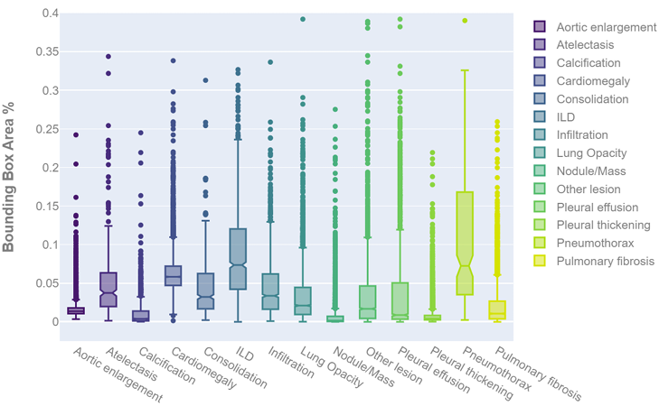
</p>

---
## Methodology

The project methodology outlines the key steps taken to develop the AI-based solution for detecting thoracic abnormalities in chest X-ray images. This process covers everything from dataset preparation to model evaluation and testing.

### 1. Model Architecture

The deep learning model used for this project is built on top of **Detectron2**, a state-of-the-art object detection framework developed by Facebook AI Research. The architecture employed is **ResNet-50 + FPN (Feature Pyramid Network)**, which is particularly well-suited for object detection tasks in medical imaging due to its capacity to capture both high and low-level features across various image resolutions.

- **ResNet-50**: A 50-layer deep residual network that excels in learning complex patterns in images while mitigating the challenges of vanishing gradients.
- **FPN (Feature Pyramid Network)**: A multi-scale feature extraction module that aggregates information from different layers, enhancing the model’s capability to detect small abnormalities in medical images.

The model was **fine-tuned** on the **VinBigData dataset**, leveraging pre-trained weights from the **COCO dataset** to boost generalization. Fine-tuning helps the model focus on learning the specific task of detecting thoracic abnormalities while benefiting from the general object detection knowledge obtained through COCO pretraining.

### 2. Training Procedure

The training pipeline incorporated various strategies to optimize the model’s performance:

- **Optimizer**: The **Adam optimizer** was used to ensure smooth convergence during training. A learning rate scheduler dynamically adjusted the learning rate based on validation performance, preventing overfitting and facilitating better convergence.
  
- **Data Augmentation**: As discussed earlier, diverse data augmentation techniques were applied to increase the variety of input data during training. This prevents the model from overfitting to the training data and improves its generalization on unseen data.

- **Loss Function**: A combination of loss functions was employed:
  - **Cross-Entropy Loss** for classification tasks (predicting the presence of abnormalities).
  - **Smooth L1 Loss** for bounding box regression, ensuring the accurate localization of abnormalities in the chest X-ray images.

- **Batch Size**: The model was trained with a batch size of **16**, balancing the computational efficiency and GPU memory usage for accelerated training.

### 3. Evaluation Metrics

To measure the model's performance, a combination of advanced evaluation tools and metrics were employed:

- **Custom COCO Evaluator**: A **COCO Evaluator** was used to compute **Average Precision (AP)** at multiple IoU thresholds, including **AP40**. The COCO Evaluator ensures that the model is accurately detecting and localizing abnormalities at different levels of overlap.

- **LossEvalHook**: The **LossEvalHook** was used to continuously monitor the training and validation losses during the training process, ensuring that the model doesn’t overfit. It allowed for real-time adjustment of hyperparameters.

- **Continuous Monitoring of Training and Validation Loss**: Both training and validation losses were visualized throughout the process, with early stopping applied when necessary to maintain generalization.

- **F1-Score**: This metric combines precision and recall to measure the balance between false positives and true positives.
  
- **ROC-AUC Score**: Used to evaluate how well the model distinguishes between normal and abnormal cases across various thresholds.

<p align="center">
  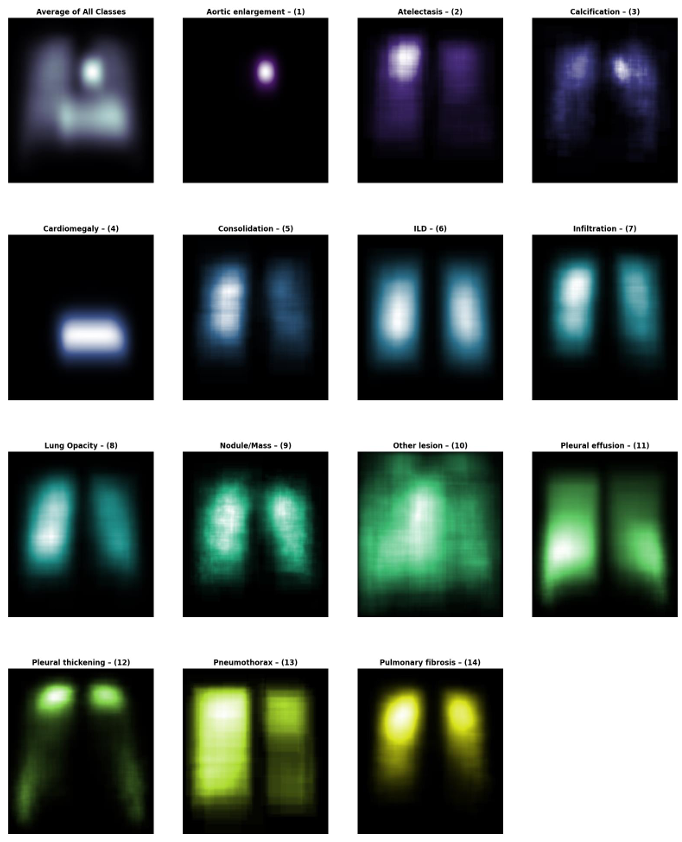
</p>

### 4. Validation and Testing

Once trained, the model was subjected to validation and testing processes to ensure its robustness and real-world applicability:

- **Validation**: A holdout validation set from the **VinBigData dataset** was used during training to monitor model performance and adjust hyperparameters. The validation set played a key role in preventing overfitting and fine-tuning the model’s learning capacity.

- **Testing**: The model’s final performance was evaluated on an unseen test set to assess its generalization capability. This provided a reliable indicator of how well the model would perform in real-world scenarios outside the controlled training environment.

### 5. Model Deployment

Once the model training and evaluation were completed, the final model was saved using **Detectron2’s export functionality** for deployment in healthcare settings. The trained model can now process chest X-rays in real-time to detect thoracic abnormalities, offering an invaluable tool for radiologists and healthcare systems aiming to improve diagnostic accuracy.

---

## 8. Results and Analysis

This section presents the results obtained after training and evaluating the model on the VinBigData Chest X-ray dataset. The results are analyzed based on key evaluation metrics, and the performance is visualized with relevant figures.

### 1. Model Performance Metrics

The model’s performance was evaluated using various metrics, including **Average Precision (AP)** at different Intersection over Union (IoU) thresholds, **F1-Score**, and **ROC-AUC**. These metrics provided a comprehensive view of how well the model performed in detecting and localizing thoracic abnormalities.

#### 1.1. Average Precision (AP)

The **Average Precision (AP)** is a crucial metric for object detection tasks, measuring how well the model detects abnormalities in terms of both precision and localization accuracy. The AP was computed at various IoU thresholds:

- **AP at IoU 0.40**: This threshold evaluates the model’s ability to detect abnormalities with at least 40% overlap with the ground truth bounding boxes.
- **AP at IoU 0.50 and 0.75**: Higher thresholds (50% and 75% overlap) further assess the model’s localization precision.

<p align="center">
  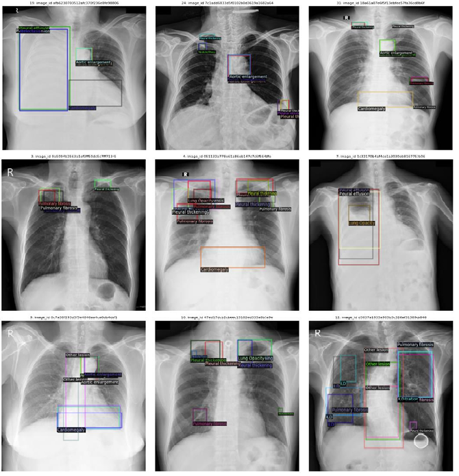
</p>

The chart shows the AP for the different abnormality classes, with the model achieving a strong performance at IoU 0.40, and slightly lower precision at higher thresholds. This indicates that while the model is able to detect abnormalities well, it may struggle with precise localization in some cases.

#### 1.2. F1-Score

The **F1-Score** provides a balance between precision and recall, measuring the model's effectiveness in identifying true positives while minimizing false positives. A high F1-Score indicates that the model is correctly identifying abnormalities without over-predicting.

<p align="center">
  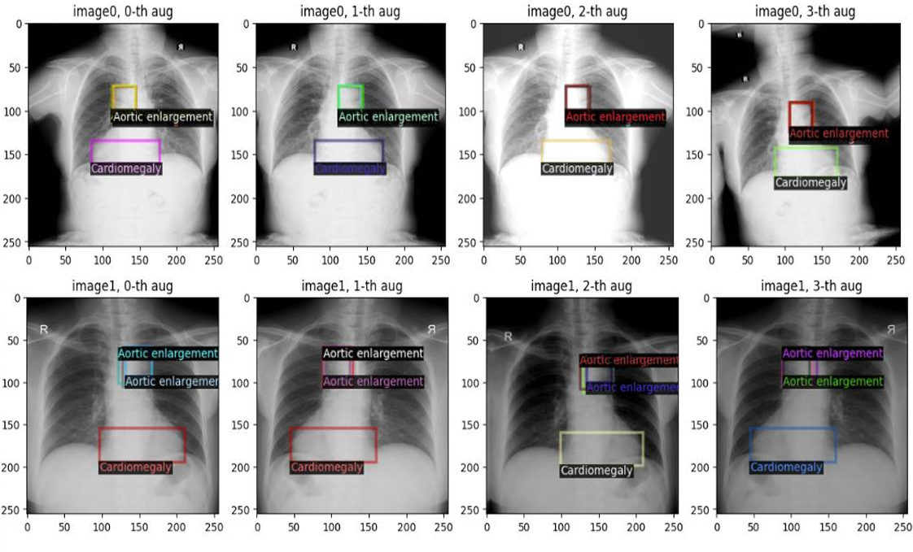
</p>

From the figure, the F1-Score remains consistent across most classes, showing the model's ability to generalize well across different types of abnormalities. Minor drops in performance for some abnormalities may suggest areas where additional fine-tuning or data augmentation could further improve results.

#### 1.3. ROC-AUC Score

The **ROC-AUC Score** evaluates the model’s capacity to distinguish between normal and abnormal cases across varying threshold settings. A high ROC-AUC score indicates the model’s ability to differentiate between patients with and without abnormalities effectively.

<p align="center">
  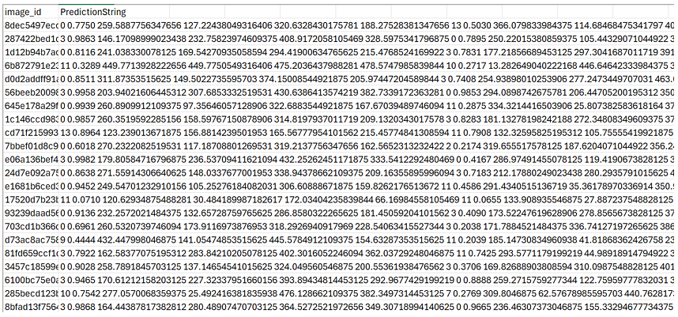
</p>

The ROC-AUC score shows that the model is able to achieve strong discrimination between positive and negative cases, further confirming the model's overall robustness.

### 2. Analysis of Results

#### 2.1. Detection Strengths

- **High Detection Rates at IoU 0.40**: The model demonstrates strong performance at lower IoU thresholds, which suggests that it is effective in identifying the presence of abnormalities, even if the localization is not perfect.
- **Strong F1-Scores Across Classes**: The model maintains high F1-Scores, indicating that it is consistently detecting abnormalities while balancing precision and recall.

#### 2.2. Areas for Improvement

- **Lower AP at Higher IoU Thresholds**: The performance of the model at higher IoU thresholds (0.50 and 0.75) indicates that it struggles with highly precise localization of abnormalities. This may be improved by:
  - Further fine-tuning of the model.
  - Applying advanced localization techniques or model ensembling.
  
- **Class-Specific Challenges**: Some classes, such as **cardiomegaly** and **pleural thickening**, show slightly lower detection and localization rates. These could benefit from additional data augmentation or specialized model tuning to better capture subtle differences in these abnormalities.

### 3. Visualizations of Results

Below are visual examples of the model’s predictions on the test set. Each image shows the predicted bounding boxes and class labels for the detected abnormalities.

<p align="center">
  
  
</p>

The predicted bounding boxes generally align well with the ground truth, particularly in images where the abnormalities are more distinct. However, there are a few cases where the model fails to capture the exact boundaries of smaller abnormalities, which may explain the lower AP at higher IoU thresholds.

### 4. Conclusion

The model has shown strong potential in automating the detection of thoracic abnormalities from chest X-rays. It performs well at detecting a variety of abnormalities at lower IoU thresholds, making it highly effective for real-world diagnostic applications where precise localization is less critical.

However, there is room for improvement, particularly in the area of precise localization and in detecting abnormalities that are subtler or less well-represented in the training data. Future work could focus on:

- **Improving Localization Accuracy**: Fine-tuning the model further, particularly focusing on challenging classes with low AP at higher IoU thresholds.
- **Class-Specific Augmentation**: Increasing the focus on underperforming classes by applying targeted data augmentation strategies.

<p align="center">
  
</p>


